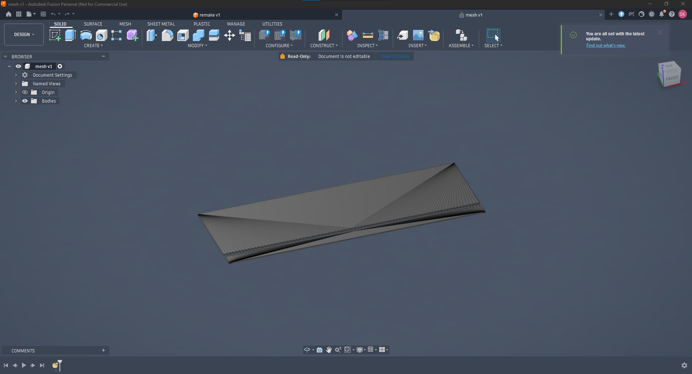

# 4. Engine Design

## Design intent

A small-scale hydrogen RDE sized for eventual manufacturability, with metal SLS
printing as the assumed process. The design was informed by the two experimental
small-scale engines held in [`../references/`](../references/): the USAF/AFIT
engine documented by Dechert and the DLR hydrogen RDE reported at ISTS 2023.
Both provided geometry classes and operating envelopes against which the sizing
below could be checked for plausibility.

## Sizing criteria

Sizing followed the empirical geometric criteria of Bykovskii and Wolanski,
which bound the smallest annulus capable of sustaining a rotating detonation in
a given mixture. All three criteria are expressed against the detonation cell
size `λ`, which is the natural length scale of the problem, and each therefore
tightens as the mixture becomes more dilute or the pressure drops.

| Criterion | Form | Governs |
|---|---|---|
| Fill height | `h* ≈ 12λ` | Whether the refreshed layer can support the returning wave |
| Channel width | `Δ` bounded below as a fraction of `h*` | Whether the cellular front fits without wall quenching |
| Chamber length | `L_c` bounded below as a multiple of `h*` | Whether the wave has room to establish before exhaust |
| Injector ratio | `π_inj = p_p / p_c ≈ 2` | Whether the injectors stay choked against back-pressure |

The criteria are empirical correlations fitted to experimental campaigns, not
derivations from first principles. They bound the design space rather than
predict performance inside it, which is the reason a simulation was needed at
all.

## Applied values

| Parameter | Symbol | Value | Basis |
|---|---|---|---|
| Combustor inner diameter | `d_c` | 75 mm | Above the minimum diameter bound; set jointly with SLS manufacturability |
| Annulus channel width | `Δ` | 2 mm | Minimum-width criterion, with margin |
| Detonation fill height | `h*` | 4.7 mm | Fill-height correlation at the design pressure |
| Mean chamber pressure | `p_c` | 5 bar | Design point, revised down from 6 bar in the December iteration |
| Plenum pressure | `p_p` | 10 bar | Choked-injector condition |
| Injector pressure ratio | `π_inj` | 2.0 | `p_p / p_c` |
| Wave multiplicity | `N_w` | 2–4 | Literature-based assumption for mass-flow bookkeeping |
| Width-to-fill ratio | `Δ / h*` | 0.43 | Above the minimum-width bound |

The resulting `Δ / h*` of 0.43 clears the minimum-width criterion with margin,
which was intentional: the fill height itself is the least certain quantity in
the set, since it depends on a cell size that was taken from correlation rather
than measured, so the width was sized not to become the binding constraint if
`h*` proved optimistic.

Local pressure at the detonation front transiently exceeds 100 bar, roughly
twenty times the mean chamber pressure, but only for a small fraction of each
cycle. The 5 bar figure is the cycle-averaged value that the injection system
must overcome, not the structural design pressure.

## Mass flow

Propellant bookkeeping used stoichiometric hydrogen and oxygen with the assumed
multiplicity of two to four waves. An early estimate of 0.7 g/s was found on
re-derivation to be wrong by a large factor and was corrected. The error had
survived several working sessions because it was carried forward rather than
recomputed, which is discussed in
[`09-lessons-learned.md`](09-lessons-learned.md).

## Injection and backflow

Detonation back-pressure driven into the injection manifold is a known RDE
failure mode. If the injectors unchoke, the manifold is exposed to chamber
transients, flow reverses, and the refill process that the wave depends on
breaks down. Passive suppression was therefore explored before settling on
choked orifices.

**Choked orifices.** The baseline solution and the one modeled. A sonic throat
fixes the mass flux by upstream conditions alone, so downstream pressure
excursions do not propagate into the plenum as long as the ratio holds. This is
the configuration used in the reference case and in most experimental engines.

**Tesla-type fluidic valves.** No moving parts, with high diodicity in the
forward direction. Purdue holds a patent on a Tesla-valve-inspired RDE injector,
and a CFD optimization study of Tesla valves is listed in the bibliography.

**Original fluidic valve concept.** Sketched and modeled in Fusion 360. Rather
than using the residual back-pressure of the flow to impede itself, which is the
Tesla mechanism, reverse flow is directed into an enclosed cavity terminating in
a permanent blockage, targeting higher diodicity than a classic Tesla channel.

**Exhaust-driven venturi assist.** Redirecting part of the exhaust momentum to
entrain fuel. Considered and set aside as adding complexity for marginal or
negative benefit.

The fluidic concepts remain future work and were not simulated. See
[`10-future-work.md`](10-future-work.md).

## Geometry

The chamber was modeled in Fusion 360 and exported as STL for CONVERGE.

*The unwrapped RDE domain in Fusion 360. The annulus is cut and laid flat, so
the azimuthal direction becomes a linear axis closed by periodic boundary
conditions.*

Two geometry approaches were attempted.

The first was a true annulus, modeled as a toroidal chamber with exhaust at the
top end. The intent was a more constricted detonation volume and potentially
better wave reliability. It failed to ignite in simulation, traced to difficulty
merging multiple boundaries on the curved topology rather than to the physics.

The second was an unwrapped, linearized annulus: the configuration used by the
CONVERGE reference case and adopted for the final design. The annular channel is
unrolled into a straight duct, with periodic boundaries on the two cut faces so
a wave exiting one side re-enters the other. This preserves continuous azimuthal
propagation at a fraction of the mesh cost and is a standard reduction in the
RDE literature. What the reduction discards is discussed in
[`08-validation-and-limitations.md`](08-validation-and-limitations.md).

Geometry hygiene proved more consequential than expected. STL normal orientation
errors, overlapping boundary patches, and unsealed surfaces each broke the case
setup at least once and had to be repaired in the CONVERGE Studio diagnosis
tools before meshing would validate.
