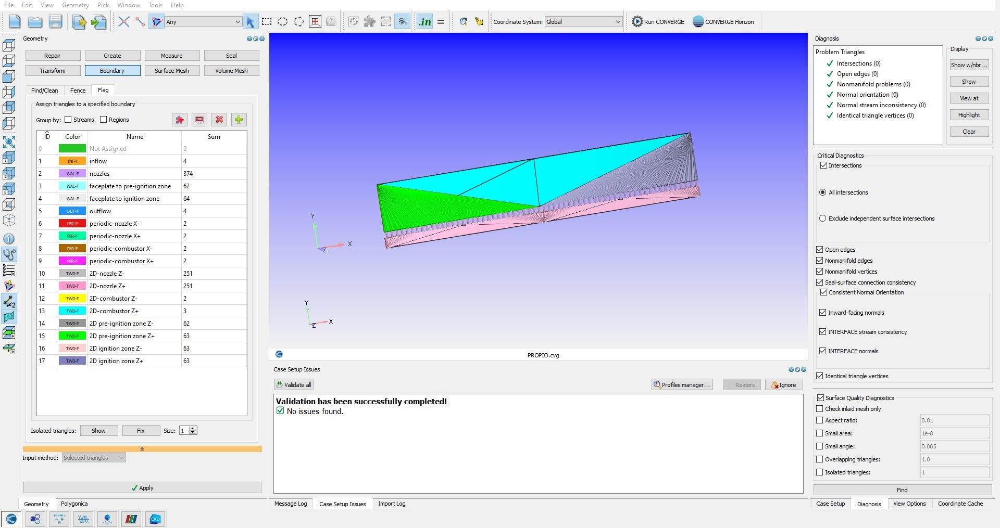

# 6. Simulation Setup

Numerical formulation is in
[`05-numerical-methods.md`](05-numerical-methods.md). This section covers the
case as configured.

## Domain

The final case is a two-dimensional unwrapped annulus. Injection nozzles run
along the bottom faceplate, outflow is at the top, and the azimuthal direction
is closed by periodic boundaries on the two cut faces. The domain is collapsed
to two dimensions by symmetry conditions on the front and back planes.

*Boundary assignment in CONVERGE Studio 5.1. Triangle counts per boundary at
left; geometry diagnosis reporting zero intersection, open-edge, and nonmanifold
errors at right. The window title bar is cropped out of the screenshot.*

## Boundary conditions

| Boundary | Type | Purpose |
|---|---|---|
| `inflow` | Inlet | Plenum feed into the injector nozzles |
| `nozzles` | Wall | Injector orifice passages, choked in operation |
| `faceplate to pre-ignition zone` / `to ignition zone` | Wall | Faceplate segments adjoining the initialization regions |
| `outflow` | Outlet | Chamber exhaust |
| `periodic-nozzle X−/X+`, `periodic-combustor X−/X+` | Periodic pair | Closes the unwrapped azimuthal direction |
| `2D-nozzle Z±`, `2D-combustor Z±`, `2D (pre-)ignition zone Z±` | Symmetry | Collapses the domain to two dimensions |

The periodic pairs carry the entire physical premise of the unwrapped reduction.
A wave leaving `X+` must re-enter at `X−` with its structure intact, or the
domain is a duct rather than an annulus and the result means nothing. Paired
patches must correspond exactly in extent and discretization; when they do not,
the mesh is invalidated without an obvious diagnostic pointing at the cause.
Several days went to isolating failures of this class, and it is the single most
error-prone part of the setup.

## Physics model selection

| Model | Selection | Rationale |
|---|---|---|
| Flow | Compressible, transient | Detonation is inherently unsteady and strongly compressible |
| Turbulence | RANS k–ε | Affordable at this cell budget |
| Combustion | SAGE detailed chemistry | Resolves finite-rate kinetics; no flamelet assumption |
| Mechanism | LLNL hydrogen | Small enough to be tractable at this budget |
| Oxidizer | Air | Matches the reference case; reduces stiffness relative to pure O2 |
| Mesh | Cartesian cut-cell, base grid plus AMR | Refinement tracks the wave front under a 500,000 cell cap |

## Initialization and ignition

Detonation initiation is numerically delicate, and a case that fails to ignite
is indistinguishable at first glance from one that is simply configured wrong.
Rather than modeling a spark or a predetonator tube, the case forces ignition
thermally from an initialization region.

A small region of the channel is initialized as inert argon at 2000 K. Fresh
hydrogen and air entering the domain contact the hot region and ignite. The
resulting deflagration accelerates and transitions to a rotating detonation,
after which the influence of the hot spot washes out of the solution.

Argon is chosen because it is monatomic and inert. It delivers the enthalpy
needed to trigger the induction chemistry without participating in it, so
ignition is repeatable without contaminating the mechanism or perturbing the
product composition that the wave subsequently propagates into.

A pre-ignition buffer region separates the ignition zone from the main combustor
so the initial transient is contained and does not directly disturb the
developing wave.

This approach is a numerical convenience, not a model of a physical igniter. It
establishes that the geometry sustains a detonation once one exists; it says
nothing about whether the engine would be ignitable in hardware, which is a
separate question noted in
[`08-validation-and-limitations.md`](08-validation-and-limitations.md).

## Instrumentation

Monitor points are embedded in the domain to record pressure and temperature
histories at fixed locations. These are the primary quantitative diagnostic. A
rotating detonation produces a repeating spike train at each monitor point, with
the interval set by the wave passage frequency; a decaying wave produces a
single pulse followed by silence. The distinction is unambiguous in the traces
and does not depend on interpreting a field animation by eye.

## Output management

Output frequency is a budgeted parameter rather than a default. An early run was
canceled after projecting 3.5 million output frames and exhausting available
disk capacity, and thereafter writes were set explicitly.

| Stream | Rate | Purpose |
|---|---|---|
| Field data | Order 100 frames per simulated window | Animation and qualitative field inspection |
| Monitor points | High rate | Wave periodicity and quantitative traces |

The two streams are deliberately decoupled. Field data is large and only needs
to be dense enough for smooth playback, while monitor-point data is small and
benefits from the highest rate available.

Post-processing used Tecplot. Early runs used ParaView, which requires
consecutively numbered files to assemble a time series and therefore needed a
helper script to rename solver output before loading.
