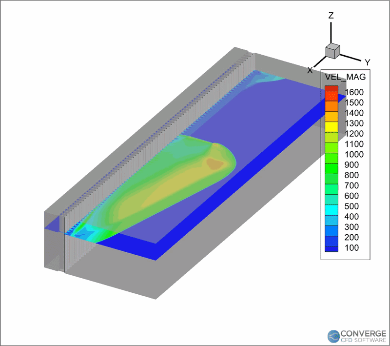

# 7. Results

## Reference case

The first milestone was reproducing the CONVERGE RDE reference case. After
approximately four days of wall-clock time on four cores, Tecplot animation of
the solver output showed a detonation wave forming out of the ignition transient
and then propagating continuously around the unwrapped annulus, which is the
defining behavior of an RDE.

*Velocity magnitude field in Tecplot. The high-velocity structure sweeping
through the channel is the detonation front; flow behind it exhausts axially.
The scale peaks near 1600 m/s, consistent with hydrogen-air detonation
products.*

### Qualitative checks

Three checks were applied against theoretical expectation. Each is a test the
result could have failed.

**Front structure.** A sharp, coupled discontinuity in pressure, temperature,
and velocity appears at the front, with the characteristic triangular
fresh-mixture fill region ahead of it. A smeared front or an absent fill
triangle would indicate either under-refinement or a refill process that is not
keeping pace.

**Periodic wrap-around.** The wave exits one periodic boundary and re-enters the
other without decaying. This confirms the periodic pair is physically
transparent, and it is the check that validates the unwrapped reduction itself.
A wave that weakens on each transit would mean the boundary is reflecting or
dissipating rather than connecting.

**Monitor-point periodicity.** Fixed-point pressure traces show repeating spikes
at the wave passage frequency rather than a single decaying pulse. This is the
quantitative form of the statement that the detonation is rotating rather than
dying.

### What was not measured

Wave speed was checked for order-of-magnitude plausibility against detonation
product velocities, but was not extracted as a calibrated value and compared
against `D_CJ`. The velocity deficit `D_w / D_CJ` is the standard health metric
in the RDE literature, and its absence is the most significant quantitative gap
in this result. Peak pressures, wave multiplicity, and thrust were likewise not
reduced from the field data.

## Custom geometry

The complete case setup, comprising chemistry, AMR controls, the initialization
region, and boundary typing, was transferred onto the Fusion 360 geometry
described in [`04-engine-design.md`](04-engine-design.md). The geometry was
re-flagged and re-meshed, periodic boundary conditions were applied to the cut
faces, and the simulation was run.

This closed the intended design loop set out in
[`02-objectives-and-requirements.md`](02-objectives-and-requirements.md):
literature, sizing, CAD, reacting CFD, analysis. Renders and animations are in
[`../media/`](../media/).

## Assessment against objectives

| Objective | Status |
|---|---|
| Complete the early-phase design loop end to end | Met |
| Reach working competence in a production CFD package | Met |
| Carry parametric CAD into the solver without topology defects | Met, after repeated surface repair |
| Derive geometric and injection criteria from the literature | Met; applied in [`04-engine-design.md`](04-engine-design.md) |
| Evaluate injector configurations against back-pressure | Partially met; concepts designed, not simulated |
| Establish sustained rotating detonation in the reference case | Met |
| Quantify wave speed against `D_CJ` | Not met |
| Grid-convergence study | Not met; precluded by the cell cap |

The honest summary is that this study demonstrates a working methodology and a
qualitatively correct detonation, not a validated engine or a quantitative
performance prediction. The reasoning behind that distinction is developed in
[`08-validation-and-limitations.md`](08-validation-and-limitations.md), and the
measurements that would close the gap are listed in
[`10-future-work.md`](10-future-work.md).
