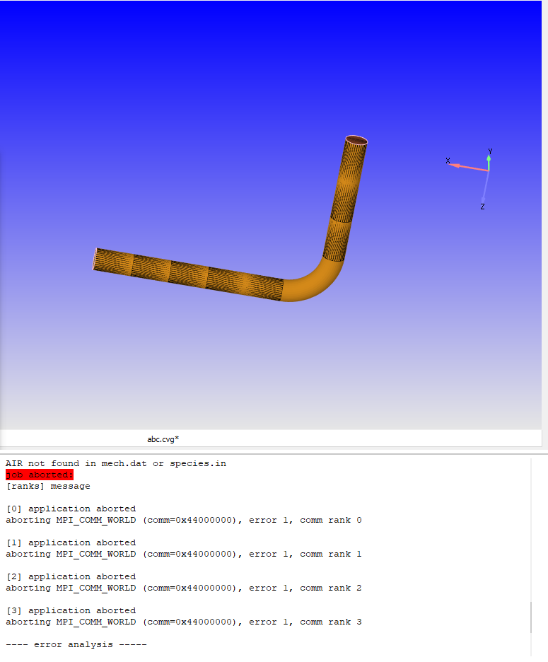

# 9. Lessons Learned

## Software access

Roughly six weeks went into obtaining usable software access. The free Explore
license arrived quickly, but its 500,000 cell cap ruled out serious
three-dimensional work and became the binding constraint on everything
downstream. The institutional academic route collapsed under months of required
process and an on-site presence requirement. What worked was direct contact with
the vendor: persistent follow-up, a licensing call, and a signed home-use
agreement.

The transferable lesson is that for gated professional tools, direct contact
with the vendor outperforms institutional process, and a second approach can
succeed where the first failed.

## Failure log

Each entry is a real failure, its diagnosis, and what resolved it. Together they
account for a substantial fraction of the project's hours.

| Failure | Diagnosis | Resolution |
|---|---|---|
| First pipe case would not run | Confusion between boundaries and regions; air species undefined | Learned the region and boundary model; defined the air mixture properly |
| `FATAL_ERROR: composite AIR not found in mech.dat or species.in` | Species referenced before mechanism data was imported | Corrected mech, therm, and trans import order |
| Mesh size error on a trivial part | Cell cap hit through an over-fine base grid | Adjusted grid controls; coarser base grid with AMR |
| Run at 0.6% after a full day, roughly a three-month projection | Grid far too fine for the hardware | Terminated; re-scoped the cell count |
| Run died at 60% | Disk exhausted by millions of output frames | Reduced write frequency; separated field and monitor streams |
| Toroidal chamber failed to ignite | Boundary merging errors on curved topology | Moved to an unwrapped domain with periodic boundaries |
| Time series would not load in post-processing | Output filenames non-consecutive | Script to batch-rename solver output |

*An early failed run on a bent-pipe case in CONVERGE Studio 3.1: the geometry
viewport (top) and the solver log with the `AIR not found in mech.dat or
species.in` fatal error (bottom), the class of setup error that taught the
species and mechanism pipeline. Both panels are crops of one screenshot; the
window title bar and the part of the log that showed local file paths were
cropped out.*

## Technical lessons

**Carried numbers need re-derivation.** An early mass-flow estimate of 0.7 g/s
survived several working sessions before a re-check showed it was wrong by a
large factor. It survived because it was carried forward rather than recomputed.
Re-deriving key quantities from scratch, rather than re-reading them, is what
caught it.

**AMR resolves the accuracy and cost conflict.** A coarse base grid with
refinement concentrated at the wave front produced usable results under a hard
cell cap. Uniformly fine grids were unaffordable by a wide margin. The cost is
that refinement follows the solution rather than leading it.

**Periodic boundary conditions are powerful and fragile.** They make the
unwrapped-annulus reduction possible, and the reduction is what brought the
problem inside the budget at all. But mismatched patch pairs fail without a
clear diagnostic, and the failure presents as a meshing problem rather than a
boundary problem.

**Case setup is where CFD time actually goes.** The large majority of hands-on
hours were spent configuring cases rather than waiting on solvers. Errors at
that stage do not degrade results, they prevent the run from starting, which
makes them cheap to detect and expensive to diagnose.

**Choked injection is the passive check valve of an RDE.** Understanding why the
plenum sits at roughly twice chamber pressure, so a sonic throat fixes mass flux
independently of downstream transients, converted a number copied from the
literature into a design rule that could be applied deliberately.

**Ignition has to be forced.** A marginal thermal initialization can simply fail
to transition within the simulated window, and the resulting null result is
indistinguishable from a configuration error. Guaranteeing initiation with an
inert hot region removed an entire class of ambiguity from the debugging
process.

## Process lessons

**Bottom-up sequencing paid off.** Working from duct flow to a simple combustion
case to the reference RDE and only then to custom geometry meant every failure
occurred on the simplest case capable of producing it. In a coupled reacting
case, a setup error and a physics error look alike; the sequence is what keeps
them separable.

**Vendor training should start earlier.** The official web seminars were
discovered too late to use fully, and months of trial and error could have been
compressed substantially.

**Practitioner contact shortcuts problems.** Professional guidance on periodic
boundary conditions, and pointers to research groups running comparable
CONVERGE-based RDE work, resolved issues that documentation and forums did not.

**Scope follows the binding constraint.** The cell cap was identified early but
its full consequences were absorbed late. Recognizing sooner that it dictated
two-dimensionality, precluded grid convergence, and therefore capped the
achievable claim would have shaped the schedule differently. What that reframing
implies for the next iteration is in [`10-future-work.md`](10-future-work.md).
